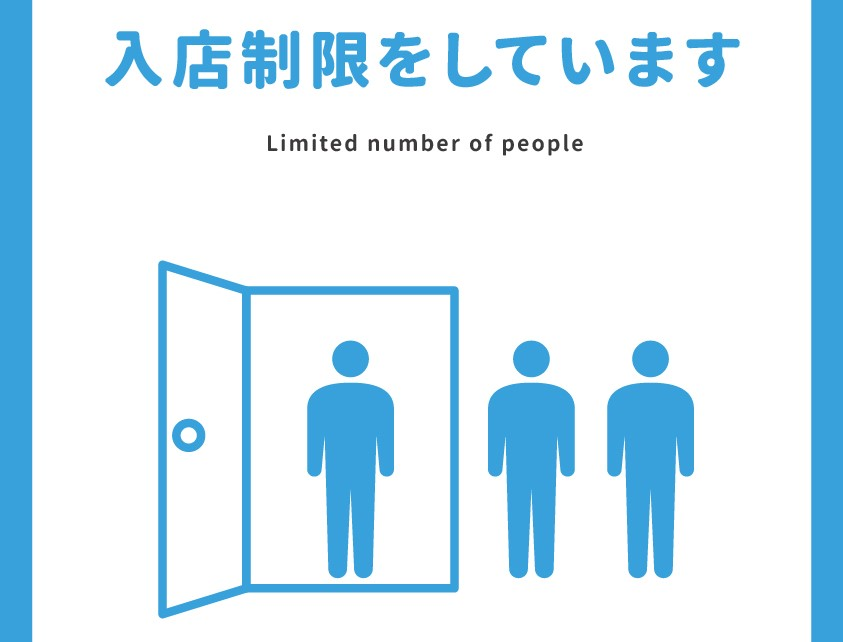
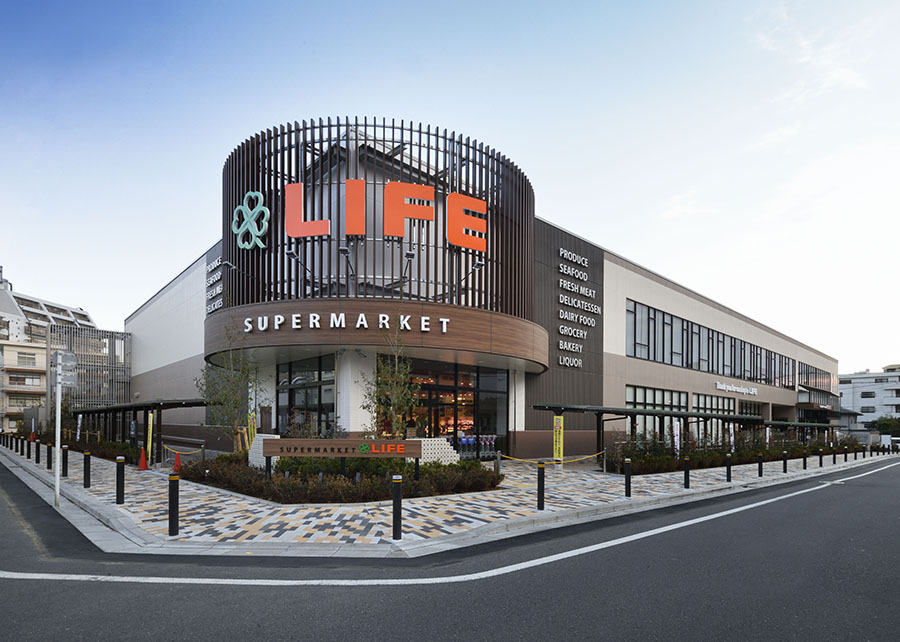
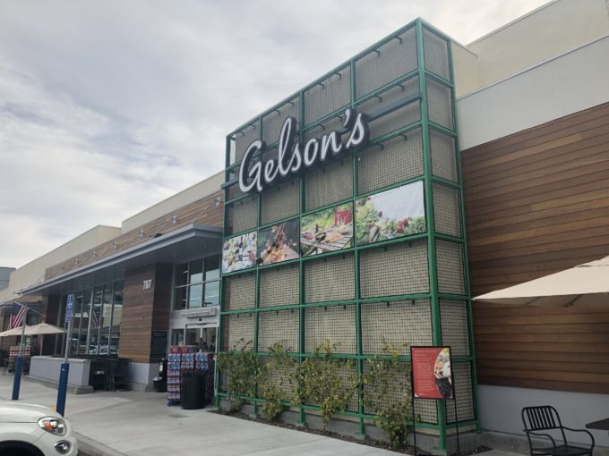
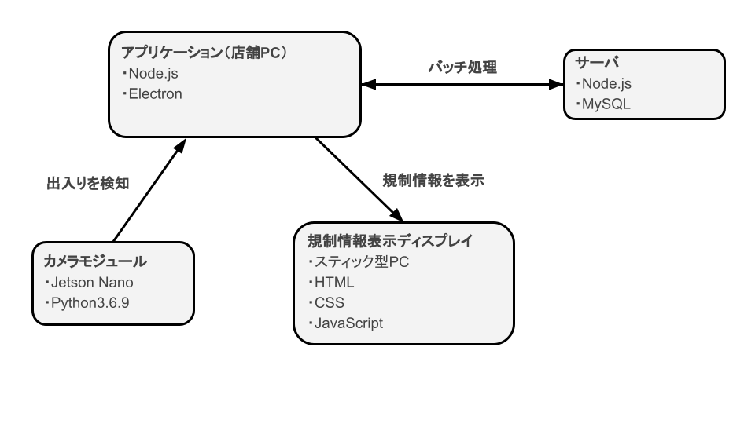

<!--
headingDivider: 1
-->

# STLESS

**A チーム**

**真鍋・山地**

# システムの概要

- コロナ対策のための入店規制を行うシステム

- 画像認識で人を検出し、ストレスフリーな入店規制を実現します

# コンセプト

**店舗・お客様双方のメンドクサイを無くす**

# ターゲット

**スーパーマーケットに代表される大規模小売店**

 

# 本システムで行うこと

1. コロナ対策のため、自動的に入場規制を行う

   - 出入口に設置したカメラを用い、画像認識によってお客様を検出して適切な入場規制を行う

2. 規制中には「どれだけ待てばよいのか」を提示する

   - 規制中にお客様へ推定待ち時間を提示する。
     これにより、お客様の「いつまで待てばよいのか」というストレスを軽減できる

# 本システムの特色

- 全ての入り口を解放可能

- めんどくさい作業が増えない

  - 店舗側…お客さんの管理
  - お客様側…整理券

- 推定待ち時間が表示される

# システム構成

# 変更点
Raspberyy pi → Jetson Nano
入退店を検出する処理
店舗PC → カメラモジュール（Jetson Nano）

**データ送信の軽量化**
**店舗PCのスペックが不要に**

# デモ

# 制作過程

- 5 月・・・設計
- 6 月・・・設計
- 7 月・・・設計，人物検出参考資料探し
- 8 月・・・卒業制作発表
- 9 月・・・設計
- 10 月・・・設計，Raspberry Pi・Jetson Nano での動作テスト
- 人物検出参考資料探し，アプリ開発

# 苦労したポイント

- 設計・・・実装方法はいろんなパターンを考え、ベストなものを選ぶ
- Raspberry Pi, Jetson Nano・・・環境構築は大変
- アプリ実装・・・あとからの変更に対応できるように余裕を持った構造にしておこう

# スケジュール

- 11 月・・・カメラ（Jetson Nano）とアプリの接続
- 12 月・・・サーバサイド（バッチ処理，データベース）開発
- 1 月・・・最終調整

